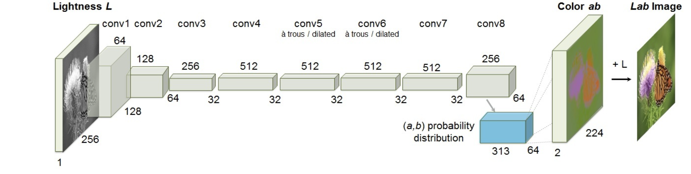

# Image Colorization Using OpenCV and Caffe

This project converts grayscale images to color images using a pre-trained deep learning model with OpenCV's DNN module and Caffe.

---

## Features

- Automatic colorization of grayscale images.
- Uses pre-trained Caffe model (`colorization_release_v2.caffemodel`) and deploy prototxt (`colorization_deploy_v2.prototxt`).
- Displays original and colorized images side by side.

---

## Requirements

- Python 3.x
- OpenCV 
- NumPy

## 🎯 Pre-trained Model Downloads

Download the required pre-trained model files from the following links:

| File Name | Description | Download Link |
|------------|--------------|----------------|
| **colorization_deploy_v2.prototxt** | Network architecture definition file for the colorization model. | [Download from GitHub](https://github.com/richzhang/colorization/tree/caffe/colorization/models) |
| **pts_in_hull.npy** | Cluster centers for the *ab* color space used during colorization. | [Download from GitHub](https://github.com/richzhang/colorization/blob/caffe/colorization/resources/pts_in_hull.npy) |
| **colorization_release_v2.caffemodel** | Pre-trained model weights (required for inference). | [Download from Dropbox](https://www.dropbox.com/scl/fi/d8zffur3wmd4wet58dp9x/colorization_release_v2.caffemodel?rlkey=iippu6vtsrox3pxkeohcuh4oy&dl=0) |

-Input Image

-Output Image

