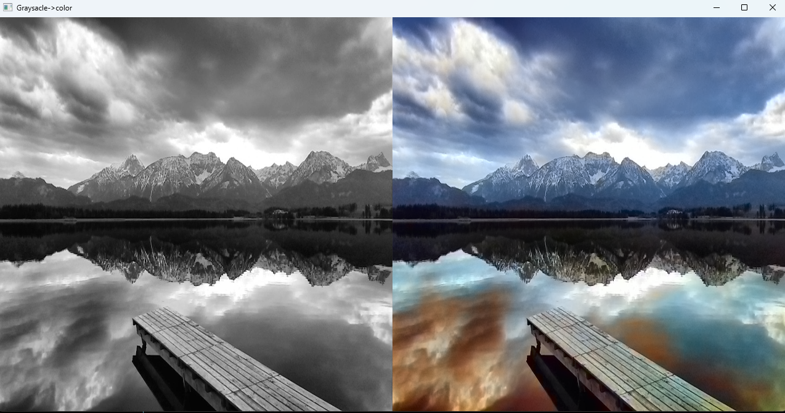

# Image Colorization Using OpenCV and Caffe

This project converts grayscale images to color images using a pre-trained deep learning model with OpenCV's DNN module and Caffe.

---

## Features

- Automatic colorization of grayscale images.
- Uses pre-trained Caffe model (`colorization_release_v2.caffemodel`) and deploy prototxt (`colorization_deploy_v2.prototxt`).
- Displays original and colorized images side by side.

---

## Requirements

- Python 3.x
- OpenCV 
- NumPy

